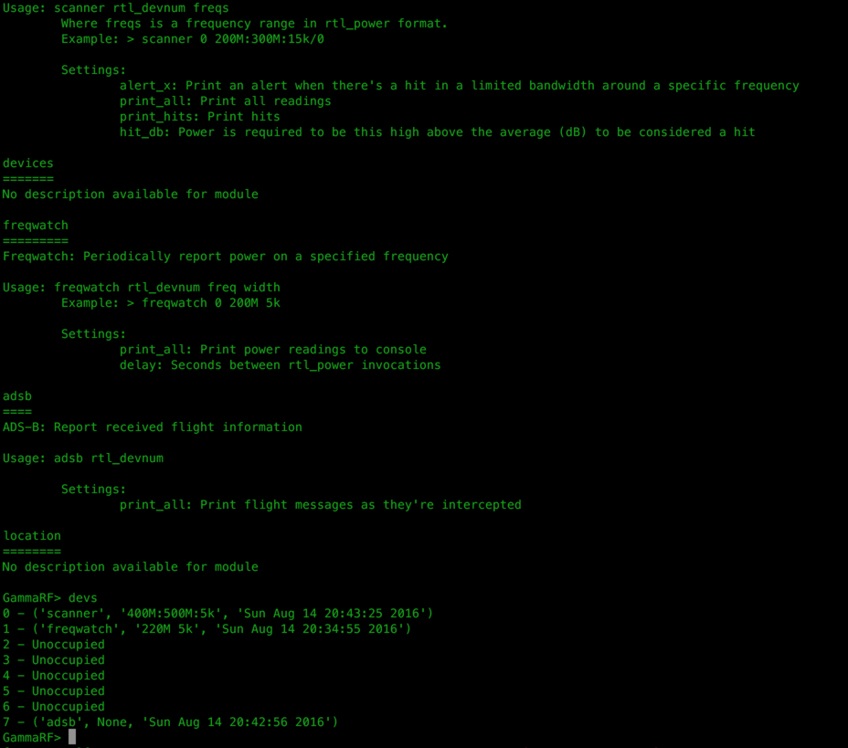

GammaRF
=======

 GammaRF is an original, cooperative, open-source project designed to bring together
   the radio enthusiast community in pursuit of ambitious goals.

 - Cooperate with users around the world to monitor the airwaves on a grand scale
 - Track aircraft, space objects, weather, public service vehicles, and so on
 - Participate in distributed HF Direction Finding (HF-DF) projects
 - ... and more.  The possibilities are endless.
  
See http://gammarf.io for more information, and installation
